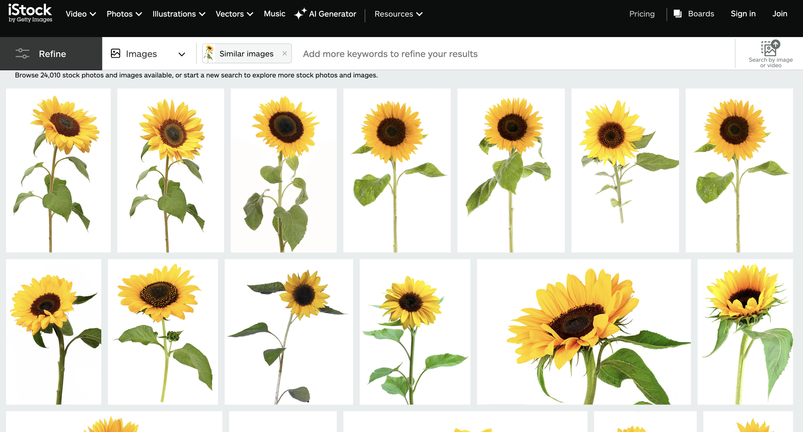

```{r setup, include=FALSE}
knitr::opts_chunk$set(echo = TRUE)
```

Welcome back! Today, I will document my experience working with and interpreting **JSON** Data for the first time. JSON stores data in memory and can exchange data between systems and APIs. It is also human and computer-readable! Today, I will obtain my JSON data based on Pixabay images from the following [***Pixabay***](https://datalandscapes.online/pixabay_api_explorer.html) API explorer.

First, let's load **tidyverse**, j**sonlite**, and the **magick** package.

```{r}
library(tidyverse)
library(jsonlite)
library(magick)
```

To begin, I must narrow down my data frame. I searched for photos using the words *"pretty"* and *"sunflower"* in my query. I chose these words because sunflowers are my favourite type of flower, and I wanted to see some pretty ones! I was also interested in the range of photo types that would be returned *(e.g., life-like or cartoon flowers and background or static image.)*

These are the first few rows of results that come up when I search pretty sunflower in Pixabay's royalty-free images to give you an example of what I'm working with:


After putting my keywords into a query in my API, I obtained my JSON data set, which I will put into a data frame called **pixabay_photo_data**.

Now, it's time to manipulate my data set. I filtered my data frame to limit the data to around 50 rows, selected the most interesting variables to explore, and mutated some new ones. This filtered dataset will be called **selected_photos**.

I created a variable called *"petal,"* which tells us whether or not the photo has the word petal as one of its tags, a variable telling us the number of characters in the user's name, and a variable for the number of characters in the tagged word. 

I also separated the rows of data so that every tagged word will show up as a different entity in the data (e.g., if one photo has the tagged words "flower" and "pretty," it will show up twice in the dataset - once for each word.)

```{r}

# MANIPULATE DATA FRAME TO CREATED "SELECTED_PHOTOS"

json_data <- fromJSON("pixabay_data.json")
pixabay_photo_data <- json_data$hits

selected_photos <- pixabay_photo_data %>%
  filter(id > 7000000) %>%
  select(previewURL, pageURL, tags, imageSize, views, downloads, likes, comments, user) %>%
  separate_rows(tags, sep = ", ") %>%
  mutate(petal_tag = ifelse(str_detect(str_to_lower(tags),
                                       "petal"),
                            "petal tagged",
                            "petal not tagged")) %>%
  mutate(user_length = nchar(user)) %>%
  mutate(tag_char = nchar(tags)) 

write_csv(selected_photos, "selected_photos.csv")

```


```{r}

# SUMMARY STATS

max_likes <- selected_photos$likes %>% max(na.rm = TRUE)

min_downloads <- selected_photos$downloads %>% min(na.rm = TRUE)

mean_comments <- selected_photos$comments %>% median(na.rm = TRUE)

max_tag_char <- max(nchar(selected_photos$tags))

```

Here are some **key findings** of the data:

1. The maximum number of likes on a photo is `r max_likes`.
2. The minimum number of downloads on a photo is `r min_downloads`.
3. The mean number of comments on a photo is `r mean_comments`.
4. The longest tagged word has a total of `r max_tag_char` characters. 

I also learned that when we group the data based on whether the word "petal" is tagged or not, the max tagged word for photos without a petal tag is 17 characters, compared to the images where petal is tagged, which only have a max tagged word of 7 characters.

```{r}

# MAX CHARACTER BY PETAL TAG

selected_photos %>%
  group_by(petal_tag) %>%
  summarise(max_tagged_word = max(nchar(tags))) %>%
  print()
```

Now, let's create something with this data. I will be using the variable **previewURL** to create an animated GIF with the magick package that cycles through each photo and displays its tagged word. Here is a table of the URLs we will be using:

``` {r - HTML table}

# HTML TABLE

pixabay_photo_data %>%
  select(pageURL) %>%
  knitr::kable() 
```

Woah! That's a lot of links! I put this into an object called **img_urls** and used the **paste** function to put the tagged words for each image into an object we can use in our GIF text.

```{r}

# ANIMATED GIF 
img_urls <- selected_photos$previewURL %>% na.omit()

paste <- paste(selected_photos$tags) # knowledge from module 2

sunflower_gif <- image_read(img_urls) %>%
  image_join() %>%
  image_scale(400) %>%
  image_annotate(paste, size = 20, gravity = "center", font = "Impact", color = "white") %>%
  image_animate(fps = 0.8) # knowledge from module 1

sunflower_gif

```

And voila! A beautiful display of the images and their corresponding tagged words! As you cycle through them, you'll notice that some tagged words are more popular. Let's use **ggplot** to visualise this.

```{r}

# SUNFLOWER PLOT

creativity_plot <- ggplot(data = selected_photos) +
  geom_jitter(aes(x = downloads,
                  y = tags)) +
                    labs(title = "What words peak our interest?",
                         subtitle = "Comparing what tagged words resulted in number of downloads",                         caption = "Source: Natasha Munn",
                         x = "Download Count",
                         y = "Words Tagged") +

theme_classic () +
  
  theme(panel.background = element_rect(fill = "#F5CA41"),
    plot.background = element_rect(fill = "#F5CA41"),
    legend.background = element_rect(fill = "#F5CA41"),
    legend.box.background = element_rect(fill = "#F5CA41")) 

creativity_plot
```

It looks like the words *sunflower, petals, and insect* are the three most popular among users and are getting the highest number of downloads!

It's been so cool turning image features into data! See you next time!